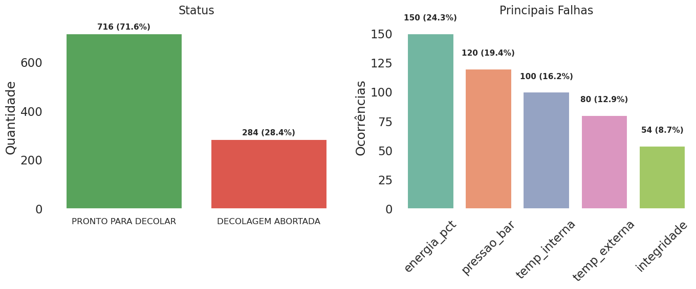

# computer_science_fiap

> Repositório do grupo contendo os projetos desenvolvidos ao longo do curso de Ciência da Computação na FIAP.

---

## Integrantes

| Nome |
|------|
| Arthur Apolonio de Oliveira |
| Matheus Bejarano da Costa Resende |
| Dayvid Daniel Duarte Ramos |
| Bryan Lima Garcia |
| Vinicius Valiati Costa |

---

## Tecnologias Utilizadas


---

## Estrutura do Repositório

```
computer_science_fiap/
├── fase1/
│   ├── codes/
│   ├── referencias/
│   ├── relatorio.pdf
│   └── requirements.txt
├── fase2/
├── fase3/
├── fase4/
├── fase5/
├── fase6/
└── fase7/
```

---

## Fases

### ✅ Fase 1 — Decolagem da Missão

[Acessar README da Fase 1](./fase1/README.md)

[Acessar Relatorio da Fase 1](./fase1/relatorio.pdf)

Análise de **1000 leituras de telemetria** do sistema pré-decolagem da espaçonave **Aurora Siger**, validando parâmetros operacionais como temperatura, integridade estrutural, níveis de energia, pressão dos tanques e status dos módulos críticos. O projeto inclui algoritmo de verificação com classificação de status, análise energética e visualizações dos resultados.




---

### 🚧 Fase 2 — *Em breve*
*(WIP)*

📄 [Acessar README da Fase 2](./fase-2/README.md)

---

### 🚧 Fase 3 — *Em breve*
*(WIP)*

📄 [Acessar README da Fase 3](./fase-3/README.md)

---

### 🚧 Fase 4 — *Em breve*
*(WIP)*

📄 [Acessar README da Fase 4](./fase-4/README.md)

---

### 🚧 Fase 5 — *Em breve*
*(WIP)*

📄 [Acessar README da Fase 5](./fase-5/README.md)

---

### 🚧 Fase 6 — *Em breve*
*(WIP)*

📄 [Acessar README da Fase 6](./fase-6/README.md)

---

### 🚧 Fase 7 — *Em breve*
*(WIP)*

📄 [Acessar README da Fase 7](./fase-7/README.md)

---

<p align="center">
  FIAP • Ciência da Computação
</p>