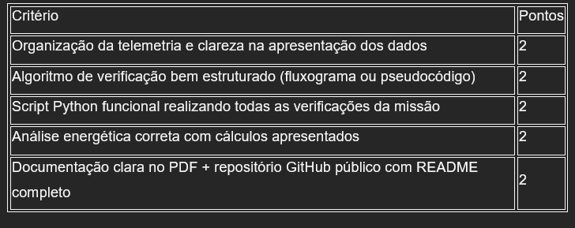

# Trabalho Integrador — Telemetria Aurora Siger

## 1. Introdução

### 1.1 Organização e descrição da telemetria
Interpretar dados referentes a:  
- Temperatura interna e externa  
- Integridade estrutural (0/1)  
- Níveis de energia (%)  
- Pressão dos tanques  
- Status dos módulos críticos  

### 1.2 Algoritmo de verificação
Construir um algoritmo (fluxograma/pseudocódigo) capaz de decidir:  
**“PRONTO PARA DECOLAR”** ou **“DECOLAGEM ABORTADA”** com base em faixas seguras predefinidas.  

### 1.3 Script em Python
Implementar a lógica do algoritmo em Python, simulando:  
- Leitura dos dados  
- Execução das verificações  
- Resultado final impresso  

### 1.4 Análise energética
Calcular autonomia inicial considerando:  
- Capacidade total (kWh)  
- Carga atual (%)  
- Consumo estimado na decolagem  
- Perdas energéticas  

### 1.5 Análise assistida por IA
Solicitar à IA:  
- Classificação dos dados  
- Identificação de possíveis anomalias  
- Sugestões de risco  

### 1.6 Reflexão crítica
Texto sobre:  
- Ética e responsabilidade  
- Impacto social da exploração espacial  
- Sustentabilidade tecnológica  

## 2. Entregáveis
É necessário:  
- Relatório em PDF contendo todos os dados pedidos na atividade integradora (códigos, análises, algoritmos etc.)  
- Link do repositório público no GitHub contendo:  
  - Notebook Python (.ipynb)  
- Arquivo README.md contendo:  
  - Explicação do projeto  
  - Prints da execução  
  - Instruções de execução do código  

## 3. Critérios de avaliação
Total: 10 pontos  
